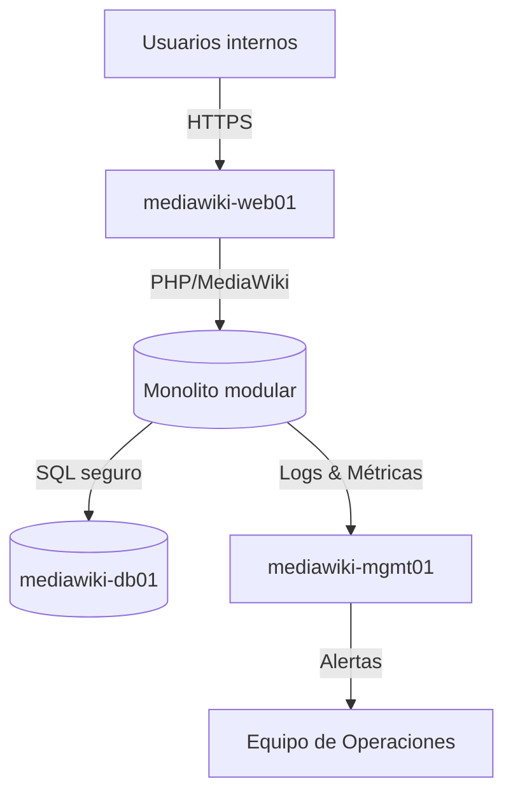

# Arquitectura principal

> Detalle expandido en [docs/03_arquitectura/arquitectura_general.md](docs/03_arquitectura/arquitectura_general.md).

## Visión general

MediaWiki Production Lab es un monolito modular desplegado en tres máquinas virtuales aisladas por capas (web, datos, gestión).

## Diagrama de alto nivel

## Componentes clave

- **mediawiki-web01**: Apache 2.4, PHP 8.1, MediaWiki 1.43, ModSecurity, Fail2ban.
- **mediawiki-db01**: MariaDB 10.6 con binlog habilitado y backups automatizados.
- **mediawiki-mgmt01**: Nagios Core, Rsyslog, scripts de validación y automatización.

## Flujos principales

1. Peticiones HTTPS llegan a `mediawiki-web01` y se procesan por MediaWiki.
2. Consultas y escrituras usan `mediawiki-db01` a través de la red `app_network`.
3. Eventos, logs y checks de salud se canalizan a `mediawiki-mgmt01`.
4. Alertas críticas se envían al equipo de Operaciones para acciones inmediatas.

## Dependencias externas

- Certbot para certificados TLS.
- Colección de reglas OWASP CRS para ModSecurity.
- `phpcs`, `phpunit`, `eslint` para pipelines de calidad.

## Referencias

- [Índice de documentación](docs/INDEX.md)
- [Plan maestro de tareas](docs/07_devops/plan_tareas_mediawiki.md)
