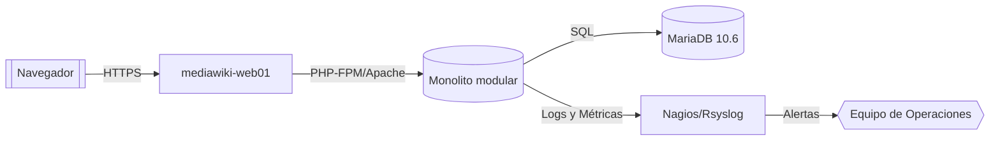

# Arquitectura Técnica Integral

> Consulta el [índice general de documentación](../README.md) para ubicar documentos relacionados.

## Resumen ejecutivo

MediaWiki Production Lab adopta una arquitectura monolítica modular desplegada sobre tres máquinas virtuales coordinadas mediante Vagrant. El objetivo es ofrecer una plataforma colaborativa resiliente, segura y fácil de operar para entornos empresariales controlados.

## Objetivo y alcance

- **Objetivo**: proporcionar un entorno MediaWiki listo para producción con hardening integral, monitoreo centralizado y automatización de operaciones.
- **Alcance**: infraestructura en VirtualBox, configuración de servicios (Apache, PHP, MariaDB, Nagios, Rsyslog), extensiones personalizadas y pipelines de validación bajo metodología TDD.

## Stakeholders

| Rol | Interés | Responsabilidades |
| --- | --- | --- |
| Equipo de Arquitectura | Coherencia del diseño | Mantener ADR, diagramas y estándares |
| Equipo de DevOps | Provisionamiento y automatización | Mantener scripts de despliegue y pipelines |
| Equipo de Operaciones | Estabilidad diaria | Ejecutar runbooks y responder incidentes |
| Equipo de Seguridad | Cumplimiento y mitigación | Auditar hardening, vulnerabilidades y parches |
| Comunidad de Usuarios | Experiencia funcional | Crear contenido, reportar incidencias |

## Arquitectura de tres capas

- **Capa de presentación**: `mediawiki-web01` con Apache 2.4, PHP 8.1 y terminación TLS.
- **Capa de aplicación**: MediaWiki 1.43 LTS como monolito modular con extensiones internas (`EmployeeDirectory`, `ProjectTracker`).
- **Capa de datos**: `mediawiki-db01` con MariaDB 10.6, replicación preparada y backups automatizados.
- **Capa de gestión**: `mediawiki-mgmt01` consolidando Nagios Core, Rsyslog y Fail2ban.

## Topología de red

| Red | Rango | Uso |
| --- | --- | --- |
| `public_network` | 192.168.1.0/24 | Acceso de usuarios al sitio MediaWiki |
| `app_network` | 10.0.2.0/24 | Comunicación segura entre web y base de datos |
| `monitoring_network` | 10.0.3.0/24 | Telemetría, syslog y checks de Nagios |
| `host_only` | 192.168.56.0/24 | Administración desde la estación de trabajo |

## Tabla de direcciones IP

| VM | `public_network` | `app_network` | `monitoring_network` | `host_only` |
| --- | --- | --- | --- | --- |
| `mediawiki-web01` | 192.168.1.100 | 10.0.2.10 | 10.0.3.10 | 192.168.56.10 |
| `mediawiki-db01` | — | 10.0.2.20 | 10.0.3.20 | 192.168.56.20 |
| `mediawiki-mgmt01` | — | — | 10.0.3.30 | 192.168.56.30 |

## Flujo de datos

1. El usuario accede vía HTTPS a `mediawiki-web01`.
2. Apache reenvía las peticiones a MediaWiki, que ejecuta lógica modular (extensiones + núcleo).
3. MediaWiki consulta y persiste datos en MariaDB a través de la red de aplicación.
4. Los eventos y logs se centralizan mediante Rsyslog en `mediawiki-mgmt01`.
5. Nagios en `mediawiki-mgmt01` vigila servicios críticos y emite alertas a Operaciones.
6. Backups y scripts de mantenimiento se ejecutan desde `mediawiki-mgmt01`, almacenándose en repositorios seguros.

## Componentes de software

| Componente | Versión | Propósito |
| --- | --- | --- |
| MediaWiki | 1.43 LTS | Motor wiki principal |
| Apache HTTP Server | 2.4 | Servidor web con TLS y ModSecurity |
| PHP | 8.1 | Runtime para MediaWiki |
| MariaDB | 10.6 | Base de datos relacional |
| Nagios Core | 4.x | Monitoreo activo |
| Rsyslog | 8.x | Centralización de logs |
| Fail2ban | 0.11 | Protección frente a fuerza bruta |
| Certbot | 2.x | Gestión de certificados TLS |

## Decisiones de diseño y trade-offs

- **Monolito modular**: se priorizó un monolito extendible frente a microservicios para simplificar despliegues y mantenimiento en entornos controlados.
- **Tres VMs separadas**: aislar servicios reduce superficie de ataque y facilita escalamiento selectivo a costa de mayor consumo de recursos.
- **Herramientas tradicionales** (Apache, MariaDB) frente a alternativas cloud-native: se eligieron por madurez, soporte en Vagrant y compatibilidad con MediaWiki.
- **Nagios + Rsyslog**: preferido sobre soluciones SaaS para mantener control on-premise, aceptando mayor esfuerzo de operación.

## Escalabilidad futura

1. Agregar un balanceador front-end (HAProxy) para múltiples nodos `web01`.
2. Configurar replicación MariaDB maestro-esclavo y plan de failover.
3. Externalizar archivos estáticos (S3 compatible) y cache (Redis/Memcached) para acelerar lecturas.
4. Automatizar pipelines de CI/CD con runners auto-hospedados.
5. Evolucionar hacia contenedores LXC/Podman manteniendo la lógica modular del monolito.

## Glosario

- **ADR**: Architecture Decision Record que captura decisiones clave.
- **Monolito modular**: Núcleo único con módulos/ extensiones desacopladas mediante hooks.
- **NRPE**: Nagios Remote Plugin Executor usado para checks remotos.

## Referencias cruzadas

- [Plan maestro de tareas](../07_devops/plan_tareas_mediawiki.md)
- [Hardening y seguridad integral](../07_devops/seguridad/hardening_y_seguridad.md)
- [Desarrollo de extensiones](../07_devops/desarrollo/desarrollo_de_extensiones.md)
