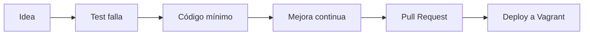

# Desarrollo de extensiones MediaWiki

> Consulta el [índice general](../../README.md) y el [plan maestro de tareas](../plan_tareas_mediawiki.md) para contexto adicional.

## 1. Introducción para nuevos desarrolladores

Bienvenido al laboratorio MediaWiki Production Lab. Este documento resume cómo preparar tu entorno, comprender la arquitectura del monolito modular y contribuir extensiones siguiendo TDD con cobertura mínima del 80%.

## 2. Preparación del entorno

1. Clona el repositorio y crea una rama feature:
   ```bash
   git clone https://example.org/mediawiki/media-wiki.git
   cd media-wiki
   git checkout -b feat/nueva-extension
   ```
2. Instala dependencias de desarrollo:
   ```bash
   make dev-setup
   ```
3. Levanta Vagrant y sincroniza el workspace:
   ```bash
   vagrant up mediawiki-web01
   ./scripts/development/sync-extensions.sh --watch
   ```
4. Exporta variables de entorno para pruebas automatizadas (`MEDIAWIKI_API_URL`, `MEDIAWIKI_ADMIN_USER`, `MEDIAWIKI_ADMIN_PASS`).

## 3. Flujo de trabajo de desarrollo (Red → Green → Refactor)



1. Escribe tests primero (`tests/phpunit/`) asegurando que fallen (fase Red).
2. Implementa la funcionalidad mínima para pasar los tests (Green).
3. Refactoriza manteniendo cobertura ≥80% y reglas PSR-4.
4. Ejecuta `./scripts/development/test-extension.sh` antes de abrir PR.
5. Sigue Conventional Commits (`feat(extensiones): ...`).

## 4. Plantilla de extensión

- **Ubicación**: `development/tools/extension-template-2025/`.
- **Estructura**:
  - `extension.json`, `ExtensionName.php`, `README.md`, `LICENSE`, `CHANGELOG.md`, `CODE_OF_CONDUCT.md`.
  - Directorios `src/`, `resources/`, `i18n/`, `sql/`, `tests/phpunit/`, `maintenance/`.
- **Buenas prácticas**:
  - Documentar hooks y mensajes i18n con comentarios en español.
  - Evitar dependencias externas no aprobadas.
  - Registrar cambios desde la primera iteración en `CHANGELOG.md`.

## 5. Arquitectura de extensiones

- Extensiones cargadas como módulos del monolito MediaWiki mediante `wfLoadExtension`.
- Separación en capas:
  - **Aplicación**: archivos en `src/` con namespaces PSR-4 (`MediaWiki\Extension\Nombre\`).
  - **Presentación**: recursos en `resources/` y plantillas Mustache cuando aplique.
  - **Persistencia**: definiciones `sql/tables.json` y migraciones de mantenimiento.
- Hooks relevantes: `SkinAfterContent`, `BeforePageDisplay`, `LoadExtensionSchemaUpdates`, `ApiMain::onCheckCanExecute`.

## 6. Estándares de código

| Área | Estándar |
| --- | --- |
| PHP | PSR-12, type hints estrictos, comentarios en español |
| JavaScript | ES2020, módulos sin dependencias globales |
| CSS | BEM y variables CSS para theming |
| Commits | Conventional Commits, mensajes en español |
| Revisiones | Dos aprobaciones cruzadas, checklist de seguridad |

## 7. Workflow de automatización

- **Creación**: `scripts/development/create-extension.sh` valida nombre, clona plantilla y ajusta placeholders.
- **Deploy**: `scripts/development/deploy-extension.sh` sincroniza archivos, actualiza `LocalSettings.php`, ejecuta `php maintenance/update.php` y limpia caché.
- **Sync continuo**: `scripts/development/sync-extensions.sh --watch` usa `inotifywait`.

## 8. Testing

1. Ejecuta el script principal:
   ```bash
   ./scripts/development/test-extension.sh NombreExtension
   ```
2. Cobertura mínima 80% con PHPUnit (`tests/phpunit/unit` y `integration`).
3. Validaciones automáticas:
   - Lint (`php -l`, `eslint`).
   - Estilo (`phpcs --standard=MediaWiki`).
   - Integridad (`composer validate`, `jsonlint`, `i18n-checker`).
4. Pruebas manuales: usa `tests/functional/test-mediawiki.sh` para confirmar integración.

## 9. APIs disponibles

- **MediaWiki Action API**: `api.php?action=query`, `action=login`, `action=edit`.
- **REST API**: endpoints `/rest.php/core/v0/page/...` para integraciones modernas.
- **APIs personalizadas**: crear clases en `src/Api/` extendiendo `ApiBase`, registrar en `extension.json`.
- **Ejemplo**: `ProjectTracker` expone `action=projecttracker&list=projects` con filtros por estado.

## 10. Ejemplos de código

### 10.1 Hook `BeforePageDisplay`
```php
<?php
use MediaWiki\Output\OutputPage;
use Skin;

return static function( OutputPage $out, Skin $skin ): void {
    $out->addModules( [ 'ext.EmployeeDirectory.styles' ] );
};
```

### 10.2 Cliente Fetch en JS
```javascript
async function crearProyecto(datos) {
  const response = await fetch('/w/api.php?action=projecttracker&format=json', {
    method: 'POST',
    credentials: 'include',
    body: new URLSearchParams({ action: 'projecttracker', format: 'json', subaction: 'create', ...datos })
  });
  return response.json();
}
```

## 11. Debugging y troubleshooting

- Habilita modo debug temporal en `LocalSettings.php` (`$wgShowExceptionDetails = true;`) solo en entornos de prueba.
- Revisa `logs/` en `mediawiki-web01` (`/var/log/mediawiki/extension-Nombre.log`).
- Usa `maintenance/showJobs.php` para diagnosticar colas.
- Captura tráfico API con `mitmproxy` o Postman Collection (`docs/07_devops/postman_validacion.md`).

## 12. Recursos adicionales

- [Hardening y seguridad integral](../seguridad/hardening_y_seguridad.md)
- [Guía de instalación](../instalacion/guia_instalacion_mediawiki.md)
- [Guía de operaciones](../../05_operaciones/manual_operaciones_mediawiki.md)
- [ADR plantillas](../../01_gobernanza/plantillas.md)

## 13. Checklist antes de merge

- [ ] Tests unitarios y de integración en verde.
- [ ] Cobertura ≥80% reportada en `tests/reports/coverage/index.html`.
- [ ] Revisión de seguridad aplicada (hooks, permisos, filtros de entrada).
- [ ] Documentación actualizada (`README.md` de la extensión, changelog).
- [ ] Scripts de despliegue verificados (`deploy-extension.sh`).

## 14. Referencias

- [Índice de documentación](../../README.md)
- [Plan maestro de tareas](../plan_tareas_mediawiki.md)
